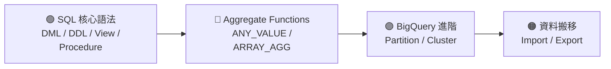

---
tags:
  - SQL
  - BigQuery
  - MOC
---

# 🗄️ SQL 知識庫

> BigQuery 為主的 SQL 語法整理，從基礎到進階。

---

## 📚 學習路徑



---

## 📂 筆記索引

### 🟢 SQL 基礎

| 筆記 | 內容 |
|------|------|
| [[sql_notes]] | DML、DDL、View、CTAS、Temp Table、Procedure 語法大全 |

### 🔵 函數

| 筆記 | 內容 |
|------|------|
| [[BQ function]] | ANY_VALUE 等 Aggregate Functions |
| [[ARRAY_AGG]] | 多行變陣列、排序、去重、STRUCT 聚合完整指南 |

### 🟣 BigQuery 效能優化

| 筆記 | 內容 |
|------|------|
| [[Bigquery note - cluster and partition]] | Partition vs Cluster 差異、建立語法、適用情境 |

### 🟠 資料搬移

| 筆記 | 內容 |
|------|------|
| [[Export and import  data to BQ]] | 從 GCS 匯入、匯出到 GCS、IAM 設定 |

---

## ⚡ 語法速查

### 最常用指令

```sql
-- 查詢
SELECT * FROM table WHERE condition;

-- 新增
INSERT INTO table (col1, col2) VALUES (v1, v2);

-- 更新
UPDATE table SET col = val WHERE condition;

-- Upsert
MERGE INTO target USING source ON condition
WHEN MATCHED THEN UPDATE SET ...
WHEN NOT MATCHED THEN INSERT ...;

-- 聚合陣列
SELECT user_id, ARRAY_AGG(product ORDER BY date DESC LIMIT 5)
FROM orders GROUP BY user_id;
```

### DDL 物件一覽

| 物件 | 生命週期 | 資料是否落地 | 用途 |
|------|----------|-------------|------|
| `TABLE` | 永久 | ✅ | 主要資料存放 |
| `VIEW` | 永久（邏輯） | ❌ | 封裝查詢邏輯 |
| `TEMP TABLE` | Session 內 | ✅ | 中間驗證 |
| `CTAS` | 永久 | ✅ | 快照 / 備份 |
| `SNAPSHOT` | 永久（手動刪） | ✅ | 時間點還原 |
| `PROCEDURE` | 永久 | — | 多步驟 ETL |

---

## 🔗 官方文件

- [BigQuery 官方文件（繁中）](https://docs.cloud.google.com/bigquery/docs?hl=zh-tw)
