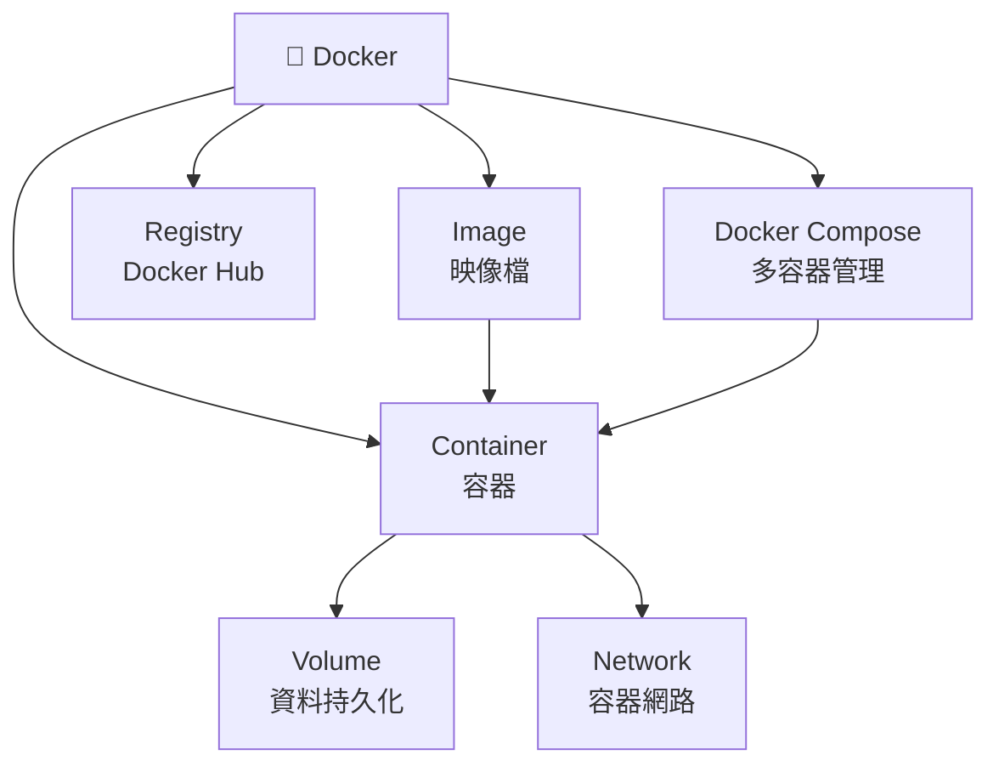

---
tags:
  - docker
  - MOC
---

# 🐳 Docker 知識庫

> 從零開始理解 Docker，到實際在專案中使用。

---

## 📚 目錄

| 筆記 | 內容 |
|------|------|
| [[01 基礎概念]] | Docker 是什麼、Container vs VM、核心元件 |
| [[02 常用指令]] | 日常必用的 CLI 指令大全 |
| [[03 Dockerfile]] | 如何寫 Dockerfile、常用指令說明 |
| [[04 Docker Compose]] | 多容器管理、yaml 寫法 |
| [[05 Volume 與 Network]] | 資料持久化、容器間通訊 |

---

## 🗺️ 概念地圖



---

## ⚡ 快速備忘

```bash
# 最常用的幾個指令
docker ps                    # 查看執行中的容器
docker images                # 查看本地 images
docker run -it ubuntu bash   # 啟動容器並進入
docker compose up -d         # 背景啟動所有服務
docker logs <container>      # 查看容器 log
```
