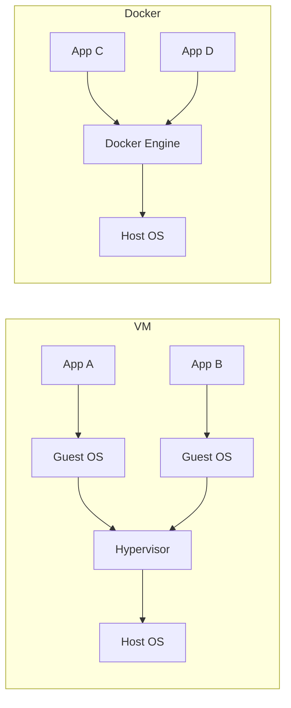
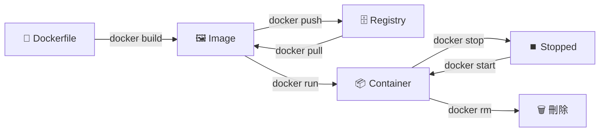

---
tags:
  - docker
  - 基礎
---

# 🐳 Docker 基礎概念

## Docker 是什麼？

Docker 是一個**容器化平台**，讓你可以把應用程式和它所需的所有環境打包在一起，做到：

> 「在我電腦上可以跑」= 「在任何地方都可以跑」

---

## Container vs 虛擬機（VM）

| | 虛擬機 VM | Docker Container |
|--|-----------|-----------------|
| **啟動速度** | 分鐘級 | 秒級 |
| **佔用資源** | 重（每個 VM 有完整 OS） | 輕（共用 Host OS 核心） |
| **隔離程度** | 完全隔離 | 行程層級隔離 |
| **適合場景** | 需要完整 OS 隔離 | 微服務、快速部署 |

---

## 核心元件

### 🖼️ Image（映像檔）
- 應用程式的**靜態快照**，包含程式碼、依賴套件、設定
- 唯讀，不可修改
- 用 `Dockerfile` 建立

### 📦 Container（容器）
- Image 的**執行實例**
- 可讀寫，刪除後資料消失（除非用 Volume）
- 一個 Image 可以跑多個 Container

### 🗄️ Registry（倉庫）
- 存放 Image 的地方
- 公開：**Docker Hub** (`hub.docker.com`)
- 私有：自架或用 AWS ECR、GCP Artifact Registry

### 📄 Dockerfile
- 建立 Image 的**食譜**
- 一行一行描述「這個環境怎麼建起來」

---

## Docker 的生命週期

---

## 常見術語快查

| 術語 | 中文 | 說明 |
|------|------|------|
| `Image` | 映像檔 | 靜態的應用程式快照 |
| `Container` | 容器 | Image 的執行實例 |
| `Dockerfile` | 建置腳本 | 定義 Image 的食譜 |
| `Docker Hub` | 公開倉庫 | 存放 Image 的雲端空間 |
| `Volume` | 資料卷 | 持久化容器資料 |
| `Network` | 網路 | 容器間的通訊橋樑 |
| `Docker Compose` | 編排工具 | 管理多個容器 |
| `Tag` | 標籤 | Image 的版本號，如 `nginx:latest` |

Kevin 想再確認這邊更新是指問卷與加一筆的體重會透過排成方式更新到ey 這邊，目前問券的資訊會員的墓目前體體重，與加一筆裡面會員填寫的體重資訊，如會員有更新自己的體重透過加一筆方式，會員問卷中的體中資訊應該是不會被改變的？

Kevin 想再確認一下這部分的更新機制。  
目前理解是：**會員健康問卷資料與「加一筆」新增的體重資料，會透過排程方式同步更新至 EY 這邊。**
但想進一步確認幾個細節：

1. 目前體重資料來源包含
    - **會員健康問卷中填寫的目前體重**
    - **「加一筆」功能中會員自行新增的體重紀錄**
2. 若會員之後透過 **「加一筆」更新新的體重紀錄**，  
    是否 **只會新增加一筆中新的體重資料**，而 **不會影響到原本健康問卷中填寫的體重欄位**？

