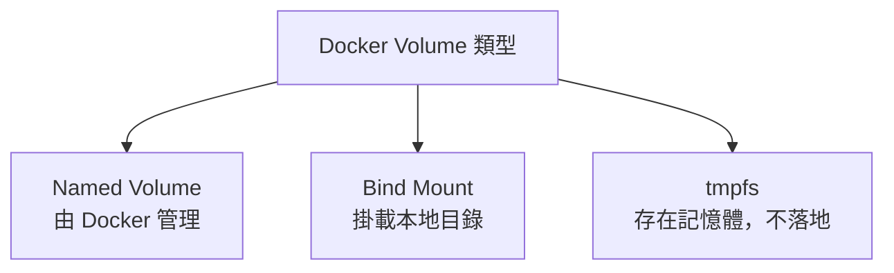
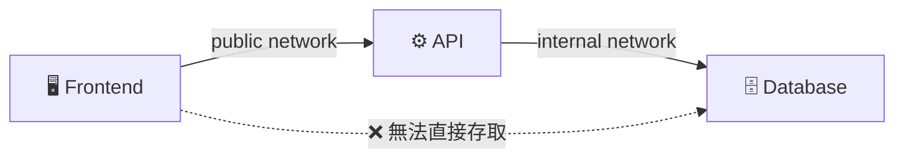

---
tags:
  - docker
  - volume
  - network
---

# 💾 Volume 與 🌐 Network

---

## Part 1：Volume（資料持久化）

### 為什麼需要 Volume？

Container 本身是**無狀態**的——
刪掉容器，裡面的資料也跟著消失。

> Volume 就是讓資料「活在容器外面」的機制。

---

### Volume 的三種類型



#### 1. Named Volume（推薦）

```bash
# 建立 volume
docker volume create my_data

# 使用 volume
docker run -v my_data:/app/data nginx

# 查看所有 volume
docker volume ls

# 刪除 volume
docker volume rm my_data
docker volume prune          # 刪除所有未使用的 volume
```

```yaml
# compose.yaml
services:
  db:
    image: postgres:16
    volumes:
      - db_data:/var/lib/postgresql/data

volumes:
  db_data:       # 宣告 named volume
```

#### 2. Bind Mount（開發常用）

把本地目錄直接掛進容器，改了本地檔案容器立即看到。

```bash
docker run -v $(pwd):/app node:20
# 或
docker run --mount type=bind,source=$(pwd),target=/app node:20
```

```yaml
# compose.yaml（開發環境）
services:
  api:
    volumes:
      - .:/app              # 本地當前目錄 → 容器 /app
      - /app/node_modules   # 但不要覆蓋 node_modules
```

#### 比較

| | Named Volume | Bind Mount |
|--|---|---|
| **管理方式** | Docker 管理 | 本地路徑 |
| **適合場景** | 資料庫、持久資料 | 開發時同步程式碼 |
| **跨平台** | ✅ | ⚠️（路徑可能不同） |
| **效能** | 較好 | 略差（特別在 Mac） |

---

## Part 2：Network（容器間通訊）

### 為什麼需要 Network？

容器之間預設是隔離的。
要讓 API 容器能連到資料庫容器，需要設定網路。

---

### Network 類型

| 類型 | 說明 | 使用場景 |
|------|------|---------|
| `bridge` | 預設，容器間可互通 | 一般開發 |
| `host` | 共用 Host 網路 | 高效能需求 |
| `none` | 完全隔離 | 安全性需求 |
| `overlay` | 跨主機網路 | Docker Swarm |

---

### 基本用法

```bash
# 建立網路
docker network create my_network

# 查看所有網路
docker network ls

# 把容器加入網路
docker run --network my_network --name api my-api
docker run --network my_network --name db postgres

# 查看網路詳情
docker network inspect my_network

# 刪除網路
docker network rm my_network
```

---

### Docker Compose 的網路（自動處理）

Compose 會**自動建立一個共用網路**，
同一個 compose.yaml 裡的服務，直接用**服務名稱**互連。

```yaml
services:
  api:
    build: .
    environment:
      # 直接用服務名稱 "db" 當 hostname
      - DATABASE_URL=postgresql://user:pass@db:5432/mydb

  db:
    image: postgres:16
```

```python
# Python 程式裡連資料庫
conn = psycopg2.connect("postgresql://user:pass@db:5432/mydb")
#                                                 ↑
#                                         直接用服務名稱
```

---

### 多網路隔離（進階）

```yaml
services:
  frontend:
    networks:
      - public          # 只在 public 網路

  api:
    networks:
      - public          # 對外接受 frontend
      - internal        # 對內連接 db

  db:
    networks:
      - internal        # 只在 internal，外部無法直接存取

networks:
  public:
  internal:
```



---

## 常見問題

**Q：容器刪掉，Volume 資料還在嗎？**
→ Named Volume 還在，要手動 `docker volume rm` 才會刪。

**Q：兩個容器要怎麼互相連線？**
→ 放在同一個 Docker network，用服務名稱當 hostname。

**Q：為什麼 `localhost` 在容器裡連不到？**
→ 容器裡的 `localhost` 是容器自己。
  → 連 Host 機器用 `host.docker.internal`
  → 連其他容器用服務名稱
